+++
author = "Gaoxz"
title = 'I2C协议'
description = "PLACE DESCRIPTION HERE"
date = 2024-09-10T14:07:22+08:00
tags = [
    "Hardware",
    "Embedded Software",
]
categories = [
    "Hardware",
    "Embedded Software",
]
+++

# I2C协议

I2C是一种半双工串行总线，其由SCL(时钟线)、SDA(数据线)两根线组成(实际使用还需要共地)。该协议被广泛应用于LCD驱动器、LED驱动器、扩展IO、RAM、EEPROM及A/D转换器、D/A转换器等应用中。I2C可以在总线上挂载多个I2C设备（且支持多主机），支持同一条I2C总线上有多个不同速率的设备同时挂载。

I2C有共有五种模式：

- Standrad Mode(Sm)：100kbit/s，能双向传输
- Fast Mode(Fm)：400kbit/s，能双向传输
- Fast Mode Plus(Fm+)：1Mbit/s，能双向传输
- High-speed Mode(Hs-mode)：3.4Mbit/s，能双向传输
- Ultra Fast mode(UFm)：5Mbit/s，**仅能单向传输**

## 双向传输协议

在I2C的四种双向传输协议中，SDA、SCL两根线必须是开漏输出的模式。SDA、SCL两线的上拉电阻需要保持一致，在选择电阻阻值的时候需要考虑到使用的I2C的速率，如速率较高需要根据情况尽量减小上拉电阻的阻值，但减小电阻的同时也需要考虑到引脚的电流耐受能力并留有一定的余量，使最大电流不至于烧毁芯片。另外，I2C总线上挂载的设备数量受到总线电容不大于400pF的限制。

| 术语     | 定义                                                         |
| -------- | ------------------------------------------------------------ |
| 发送器   | 发送数据到总线的设备                                         |
| 接收器   | 从总线接收数据的设备                                         |
| 控制器   | 启动传输、生成时钟信号、并终止传输的设备                     |
| 目标     | 控制器寻址的设备                                             |
| 多控制器 | 多个控制器可以尝试同时控制总线而不会中止消息                 |
| 仲裁     | 当多个控制器准备控制总线时，决定由哪个控制器控制总线，并保证数据不会损坏的机制 |
| 同步     | 同步两个或多个设备的时钟信号                                 |

在一般的应用场景中，很少会用到多控制器同时在一个I2C总线上的情况，一般的应用场景都是将MCU作为控制器，EEPROM等设备作为从机对主机的业务进行应答。

下面是两个控制器（两个主机）之间进行I2C通信的例子：

- A传输数据到B

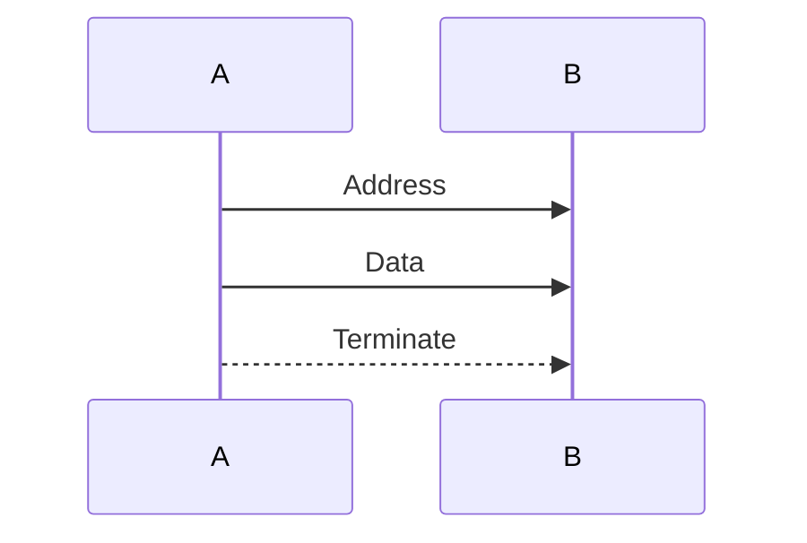

> 这个过程用文字表述如下：
>
> 1. A作为控制器首先向目标B进行寻址；
> 2. 确认B是寻址目标后，A作为控制器发送方控制SCL线和SDA线向B发送数据
> 3. 发送完成后，A将总线转变为空闲状态。

- A需要从B接收数据

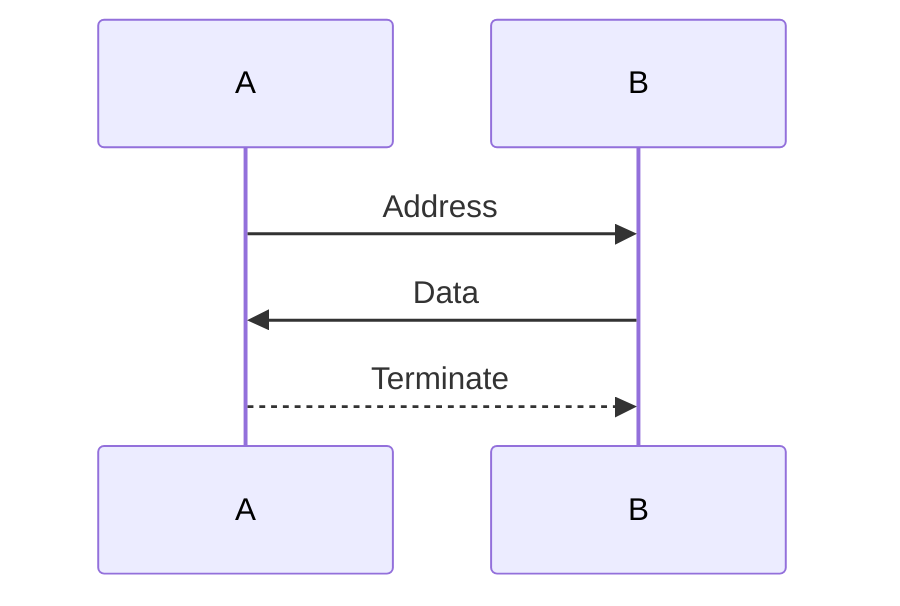

> 这个过程用文字表述如下：
>
> 1. A作为控制器首先向目标B进行寻址；
> 2. 确认B是寻址目标后，A作为控制器接收方控制SCL线时钟，B作为目标发送方控制SDA线向A发送数据
> 3. 发送完成后，A将总线转变为空闲状态。

在上述的两个过程中，A和B不是特定的，具体是由A做控制器还是B做控制器是由实际的应用场景决定。如果是一条总线上仅有一个主机控制一个或多个从机，则主机位于上述两个例子中的A的位置，从机位于B的位置。

### SDA及SCL信号

SDA、SCL两个信号线是双向线，通常会将SDA、SCL两线设置为开漏输出的模式。两线的逻辑电平如下表：

| 逻辑电平 | 实际电平范围 |
| -------- | ------------ |
| 0        | <0.3 VDD     |
| 1        | >0.7 VDD     |

表中VDD为总线的高电平电压，该电压的取值需要考虑抗干扰性能（需要抗干扰性能上升则适当增大该电压），但需要注意该电压取值不能超过器件的耐受电压和耐受电流。

### 数据帧结构

#### 数据有效性

SDA线的数据必须在SCL时钟周期电平为高的时候保持稳定，仅可以在SCL时钟周期电平为低的时候改变。一个时钟周期仅传输一个数据位。如果不能在SCL为高的时候保持数据稳定，将认为该数据无效。

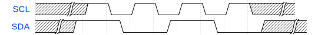

#### 数据起始位及停止位

数据起始位的标志是：控制器保持SCl线为高电平的时候，将SDA线由高电平变为低电平（SCL高时检测到SDA下降沿）。当SCL线拉低后，意味着将开始进行地址数据的传输。

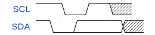

数据停止位的标志是：SCL线停止传输时钟后被置高，检测到SDA线由低电平变为高电平（SCL高时检测到SDA上升沿）。

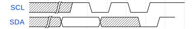

数据的起始信号和停止信号仅能由主机（控制器）发起。当起始位信号发出后，总线被认为是忙碌状态的。在停止位后的一定时间后，总线才被认为是再次空闲的。

而数据的停止情况有以下两种：

- 主机发送完成，停止发送信号
- 从机不想接收数据，不对主机做应答，主机发送停止信号结束此次通信。

对于用软件方式实现I2C的时候，每个时钟周期至少需要对SDA线路进行两次采样，以检测停止位和起始位。

#### 字节格式

SDA线每次传输的字节都必须有8位长，每次可传输的字节数不受限制。每个字节后必须跟一个确认位（ACK）。数据在传输的时候从最高有效位开始传输数据（先传输高位，后传输低位）。如果目标正在之星其他功能无法接收或传输另一个完整的数据字节，则它可以将时钟线SCL保持在低电平，以强制控制器进入等待状态，当目标准备好接收另一个字节的数据时将释放SCL线，此时数据传输将继续。

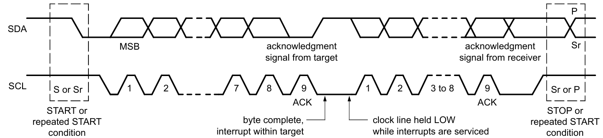

#### 确认位(ACK) & 未确认位(NACK)

在确认位的时钟周期中，接收器将被允许向发送器发送一个信号，表明该字节已经成功接收，并可以发送另一个字节。在该时钟周期后将传输下一个字节的数据。

确认位的标志是：在确认位的时钟周期中，接收器将SDA线拉低至低电平，并在该时钟周期的高电平器件保持住。当确认位时钟周期结束，接收器需要将SDA线释放。

如果在确认位的时钟周期中SDA线保持高电平，则将被认为是未确认位（NACK）信号。检测到该信号后，控制器可以发出停止位中止数据传输，也可以重新发送起始位以启动新的传输。

NACK位的产生有以下几种情况：

1. 总线上没有传输地址的接收器，因此没有设备可以相应；
2. 接收器正在执行某些实时性功能，没有准备好于控制器通信，处于无法接收或发送的状态；
3. 传输的过程中，接收器收到了不理解的命令；
4. 传输的过程中，接收器无法再接收数据；
5. 控制器-接收器必须向目标的发射出发出结束位信号

#### 目标地址及读写位

目标地址及读写位是I2C通信的时候最早被传输的数据，用于确认I2C总线上的响应设备及本次的读写情况（R/W位为低则表示本次通信为主机向从机写入数据，R/W位为高则表示本次通信为主机从从机读取数据）。

I2C的地址分为7位地址和10位地址两种，但其中有16各地址保留用于特殊用途。一条I2C总线上可以同时有7位地址设备和10位地址设备挂载。保留地址的列表如下：

| I2C 节点地址 | R/W  | 位功能描述           |
| ------------ | ---- | -------------------- |
| 0000 000     | 0    | 广播地址             |
| 0000 000     | 1    | 起始字节             |
| 0000 001     | X    | CBUS 地址            |
| 0000 010     | X    | 保留用于不同总线格式 |
| 0000 011     | X    | 保留供未来使用       |
| 0000 1XX     | X    | 高速模式主代码       |
| 1111 1XX     | X    | 保留供未来使用       |
| 1111 0XX     | X    | 10位节点地址         |

##### 7位地址数据帧格式

主机向从机写数据：

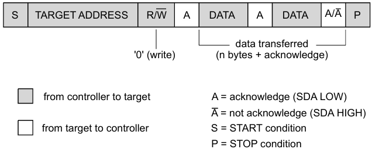

主机从从机读数据：

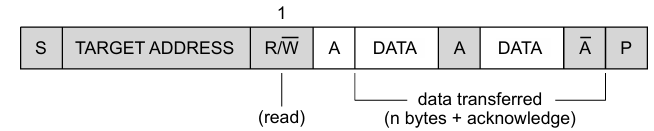

##### 10位地址数据帧格式

主机向从机写入数据：

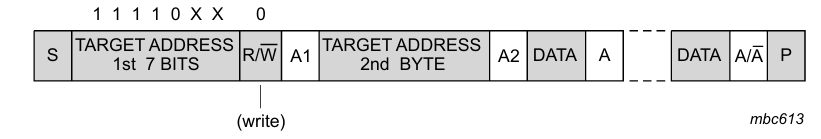

主机从从机读取数据：

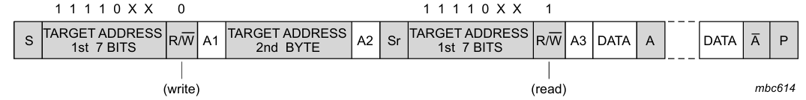

#### 一次完整的I2C通信波形图

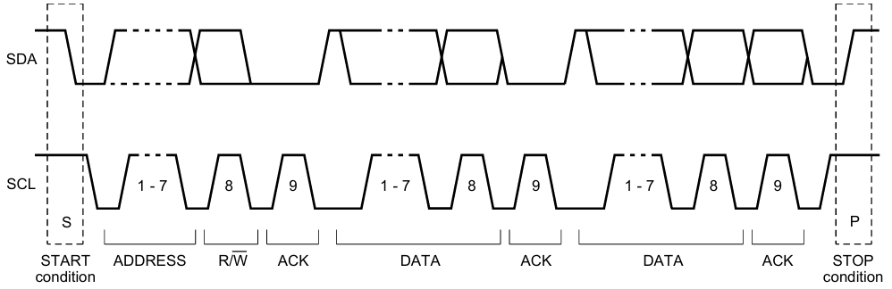

## 单向传输协议（UFm）

I2C的单向传输协议仅有Ultra Fast mode一种模式。该模式下I2C总线也是由SDA、SCL两根线组成，为于双向传输协议的总线名称做一定区分，将使用USDA、USCL做表示。

### USDA及USCL信号

USDA、USCL两个信号线是单向线。USDA、USCL两线均为推挽输出的模式。两线的逻辑电平如下表：

| 逻辑电平 | 实际电平范围 |
| -------- | ------------ |
| 0        | <0.3 VDD     |
| 1        | >0.7 VDD     |

连接到总线的接口数量受总线负载、从线路末端或连接器或短截线收到的反射限制。

### 数据帧结构

#### 数据有效性

与双向协议一样，USDA线的数据必须在USCL时钟周期电平为高的时候保持稳定，仅可以在USCL时钟周期电平为低的时候改变。一个时钟周期仅传输一个数据位。如果不能在USCL为高的时候保持数据稳定，将认为该数据无效。

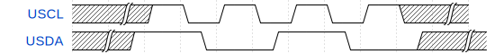

#### 数据起始位及停止位

单项协议中的数据起始位及停止位信息与双向协议一样。

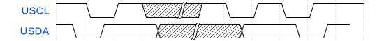

#### 字节格式

与双向协议一样，USDA线上每次传输的字节必须由八位，且也是从最高有效位开始传输。每次传输可以传输的字节数不受限制。当目标无法接收另一个完整的数据字节或在执行其他功能时，不允许将时钟保持在低电平。与双向协议不同的是，在单向协议中从机将不再发出ACK信号，而是只将USCL信号线拉低，在准备好后释放信号线开启下一字节的信号的接收。

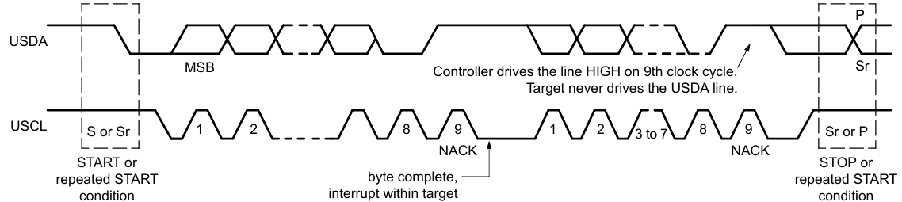

#### 确认位（ACK） & 未确认位（NACK）

由于在双向协议中，目标将不再对第9个时钟周期进行响应，因此实际上也不需要ACK和NACK。为了与I2C总线的双向协议兼容，UFm中保留了第9个时钟周期，在第9个时钟位USDA线将被驱动为高电平。任何时候都不允许目标设备驱动USDA线路。

#### 目标地址及读写位

与双向协议一样，目标地址也由7位和10位两种。但是其地址保留的用途与双向协议略有差别。与双向协议不同的是，单向协议的读写位将始终为0（只发不读）。

| I2C 节点地址 | R/W  | 位功能描述   |
| ------------ | ---- | ------------ |
| 0000 000     | 0    | 广播地址     |
| 0000 000     | 1    | 起始字节     |
| 0000 001     | X    | 保留未来使用 |
| 0000 010     | X    | 保留未来使用 |
| 0000 011     | X    | 保留未来使用 |
| 0000 1XX     | X    | 保留未来使用 |
| 1111 1XX     | X    | 保留未来使用 |
| 1111 0XX     | X    | 10位目标地址 |

##### 7位地址位数据帧格式

7位地址为的发送格式如下：

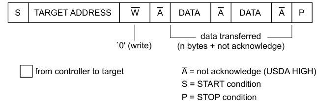

##### 10位地址位数据帧格式

10位地址位的发送格式如下：

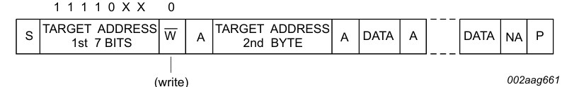

## 参考文献

- [NXP User Manual - UM10204 I2C-bus specification and user manual](https://www.nxp.com/docs/en/user-guide/UM10204.pdf)
- [TI Application Note - A Basic Guide to I2C](https://www.ti.com/lit/pdf/sbaa565)
- [ADI 技术文档：《I2C通信协议：了解I2C Primer、 PMBus和SMBus》](https://www.analog.com/cn/resources/analog-dialogue/articles/i2c-communication-protocol-understanding-i2c-primer-pmbus-and-smbus.html)
- [图莫斯 技术文档：《IIC/I2C从地址之7位，8位和10位详解》](http://www.toomoss.com/news/12-cn.html)
