+++
author = "Gaoxz"
title = 'Python安装及包管理'
description = "一个Python安装及管理的小教程"
date = 2024-06-27T00:39:27+08:00
tags = [
    "Software",
    "Python",
]
categories = [
    "Software",
]
+++

# 01_Python安装及包管理

本文将主要就Windows操作系统和Linux操作系统中python的安装以及包管理相关操作进行说明。

## Windows操作系统的Python安装

### Python安装

安装纯Python是个人相对来说更推荐的方法。相较于Anaconda体积更小，使用命令直接操作也比较便捷。而且Anaconda存在商用版本和社区版的区别，虽然对个人开发者和研究人员可以使用社区版，但相较于Python而言存在一定的法律风险。而且Anaconda所占的硬盘空间也较多。~~总之个人十分不推荐，即便它算是Python最成功的包管理及Python环境管理软件。~~

首先，Python的安装包可以从下面的链接处下载：

- [Python安装包](https://www.python.org/downloads/windows/)

**请务必注意，虽然Windows自带的 Microsoft Store 中也可以搜到Python，但是一定不要从里面安装！！！**

**另外，虽然Windows现在可以使用winget进行类似Linux的软件安装，但是由于其默认的安装路径不可控，因此不推荐使用。**

#### 确定Python版本

在该页面下可以找到Python到目前为止的所有Windows系统的安装包。可以在该页面安装一些已经被Python官方停止支持的Python版本（部分项目会用到非最新的Python，有些上古项目甚至可能用到Python2）。

选择Python版本的时候可以选择一个与项目组匹配的Python版本，如果只是自学也可以只安装最新的Python版本（一般尽量选择稳定版本）。

选择完版本号后，还需要根据电脑的处理器架构选择正确的处理器版本。

在此以Python 3.12.4为例，一般选择 Windows installer(64-bit) ，点击后即开始下载。

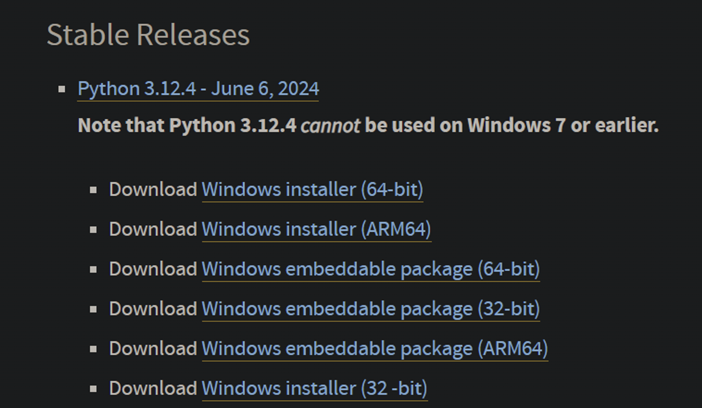

#### 安装

由于本人已经安装过Python3.12，故后续以Python3.11做示例，一般来说Python的安装过程不会因版本变化产生较大差别。

1. 以管理员身份运行安装程序，将两个复选框勾选后点击Customize installation

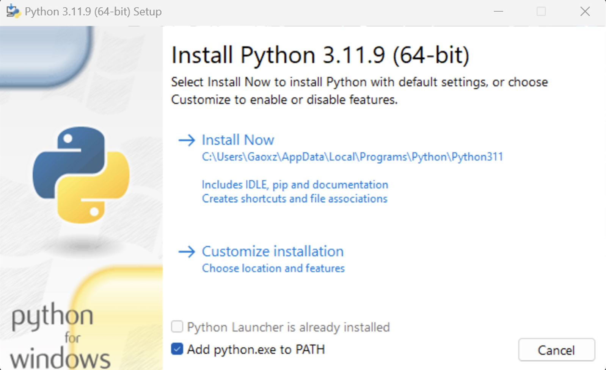

2. 除 for all user之外全部勾选，点击Next

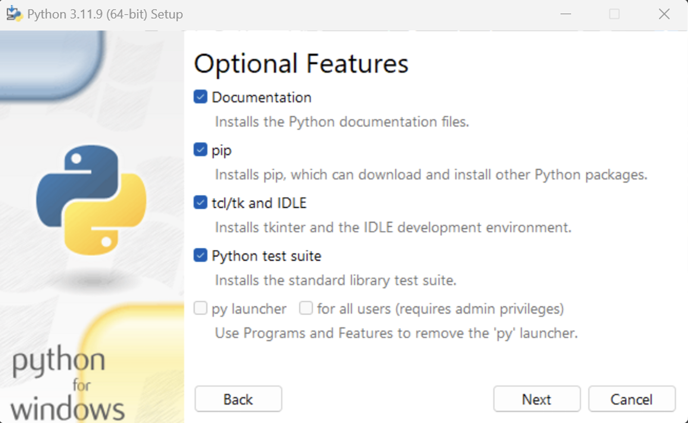

3. 勾选红框框中的4个复选框，并修改安装路径

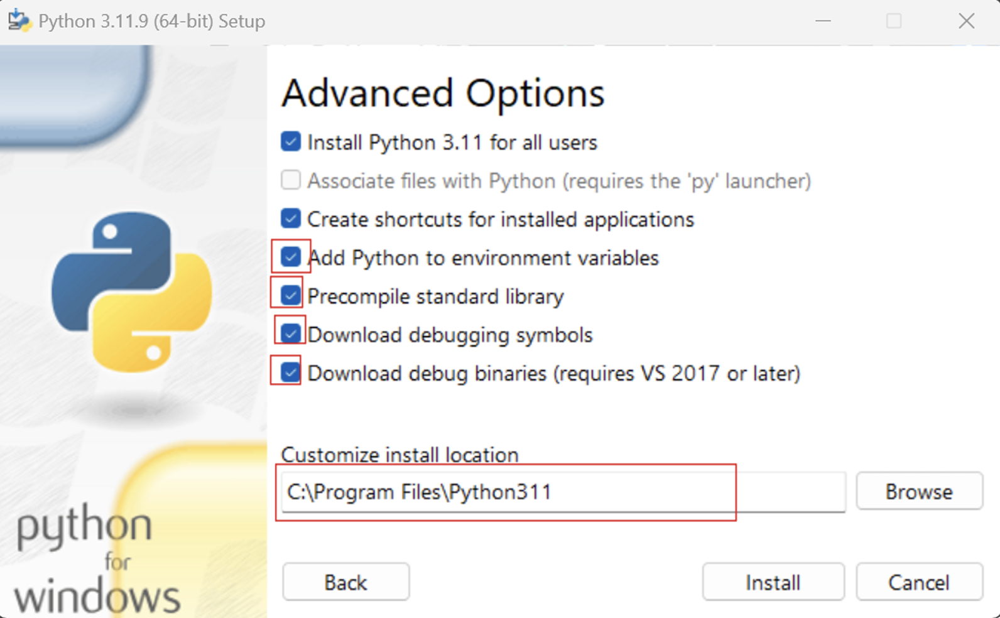

> 由于本人使用的Python版本较少且C盘容量够大，一般建议在非系统盘的根目录建立单独的Python文件夹，在Python文件夹下再单独存放不同版本的Python。下面是一个示例

```
D:\Python
	├─Python311
	├─Python312
	├─........
	└─Python38
```

举个例子，本次安装的Python 3.11，在Customize install location中需要填入：

```shell
D:\Python\Python311
```

点击Install即可完成安装。

#### 安装后的确认

按Win键搜索Powershell，输入Python，如果能够正确输出如图的版本号则安装成功。

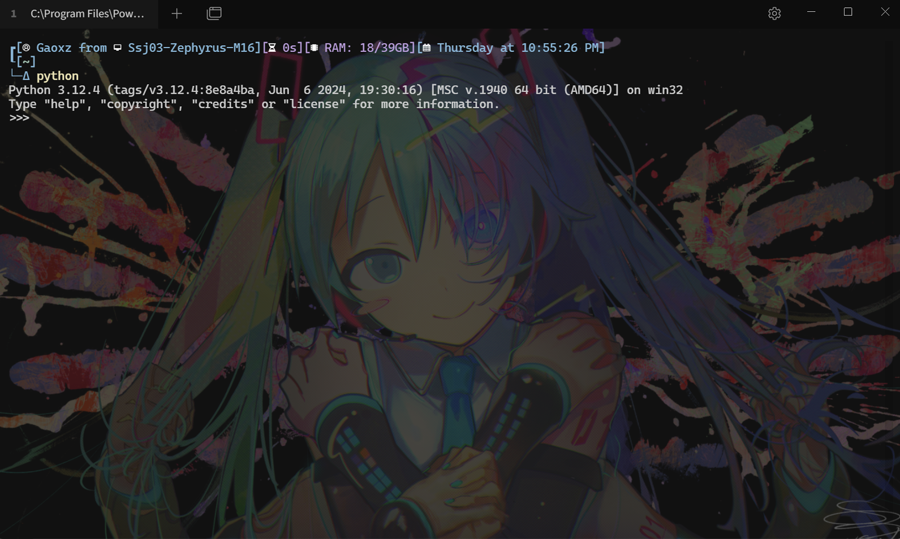

若安装正确，则关闭当前窗口，或输入下面命令回车，即可退出。

```python
quit()
```

如果未正确输出，请查看下一节中关于环境变量的说明进行修改。

#### 多版本Python的安装及管理

如果需要安装多个版本的Python，一般按照上述内容，重复 确定Python版本 --> 安装即可。

但是多个Python包安装后，其Python解释器的启动文件都叫python.exe，且这些多个版本的Python都在安装的时候选择了将各版本的python注册到系统的环境变量中。如果继续在Powershell中使用python来调用python可能就不能找到所需的Python版本。其解决方法已经被Python内置（安装时选择的 py launcher），其调用方法如下：

```shell
py
```

输入该指令后，py launcher将从系统环境变量中查找安装的Python版本。如果没有任何的参数输入，将调用默认的Python版本。

设置Python的默认版本的方法如下：

1. 按win键搜索 “环境变量”
2. 在弹出的窗口点击“环境变量(N)”

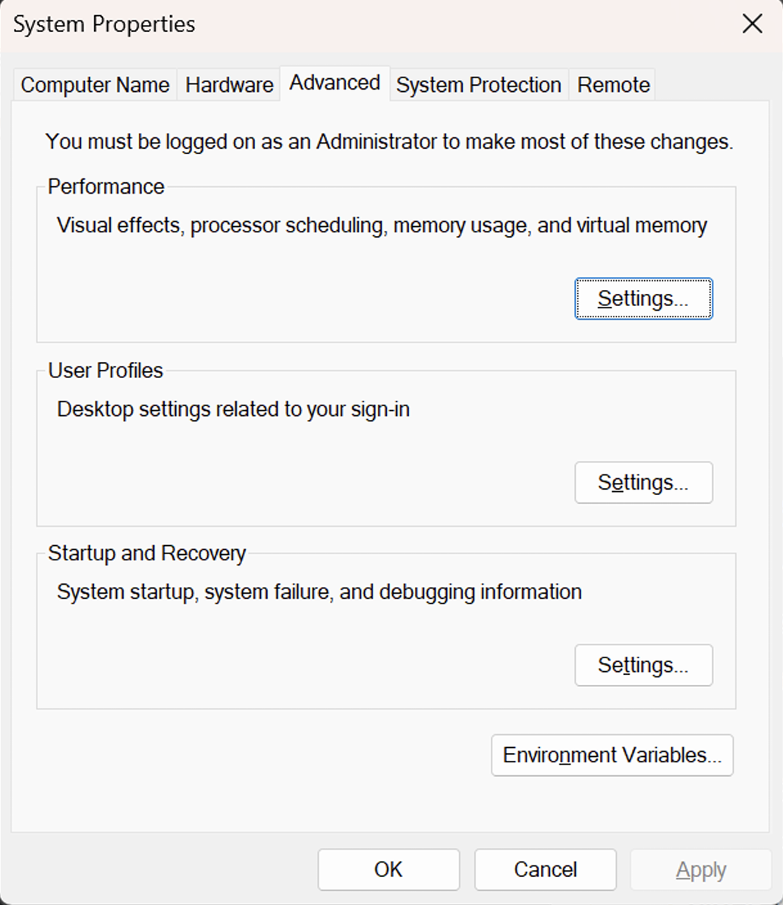

3. 如果在安装的时候没有勾选 Install Python for all users，则python的环境变量应保存在上半框中的Path中；如果安装的时候勾选了Install Python for all users，则python的环境变量应保存在下班框中的Path中。（是否勾选需要所有python版本在安装时保持一致）
4. 双击Path变量，可以看到如下界面。以下图为例，可以看到本机共安装了 Python 3.12 和 Python 3.11 两个版本，且Python3.12的两个相关变量位于Path中更靠前的位置。假设本机只安装了这两个Python版本，Path变量这样的排列这意味着：在这台机器如果使用只使用 py 指令而不加任何其他参数，系统将优先调用3.12版本的Python（直接输入python也将调用3.12版本）。如果需要将3.11设置为默认版本，则需要分别选中python311的两个相关路径，点击右侧的 Move Up，让两个python311变量均在python312之前，并点击ok进行保存（三层都要点ok），保存完后关闭已打开的powershell重新打开，输入py 或者python就会调用3.11版本的Python。

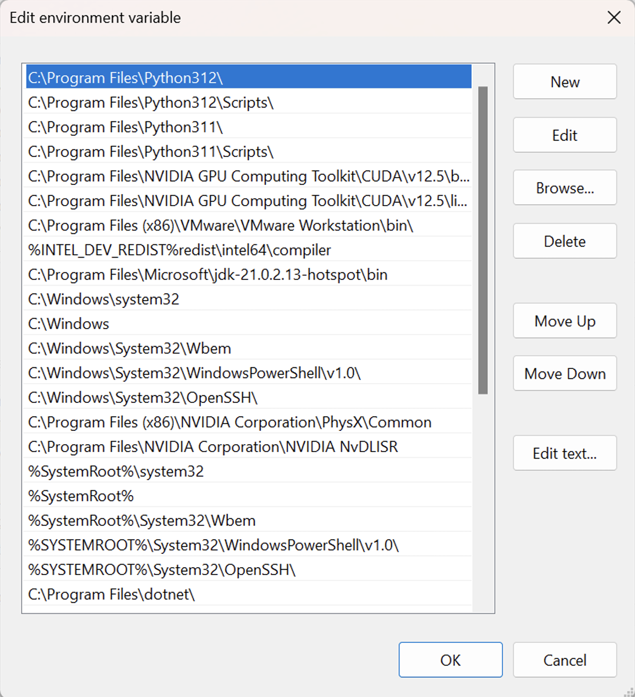

> 对于安装之后在Powershell中输入python无反应的情况，需要在上图所示界面将python路径加入：
>
> 1. python.exe所在的路径
>
> 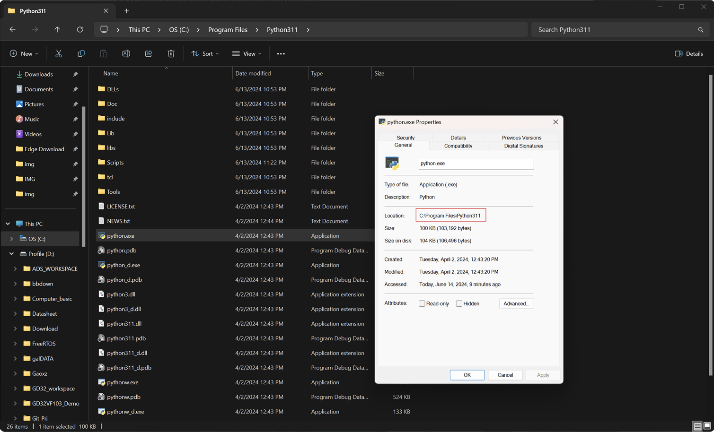
>
> 2. pip.exe所在路径：python.exe所在路径的基础上加上"PYTHON_PATH\Scripts"

关于py的使用下面给一个较为简单的说明：

查看当前已成功安装的python版本：

```shell
py --list
```

使用该命令后，输出的log如下：

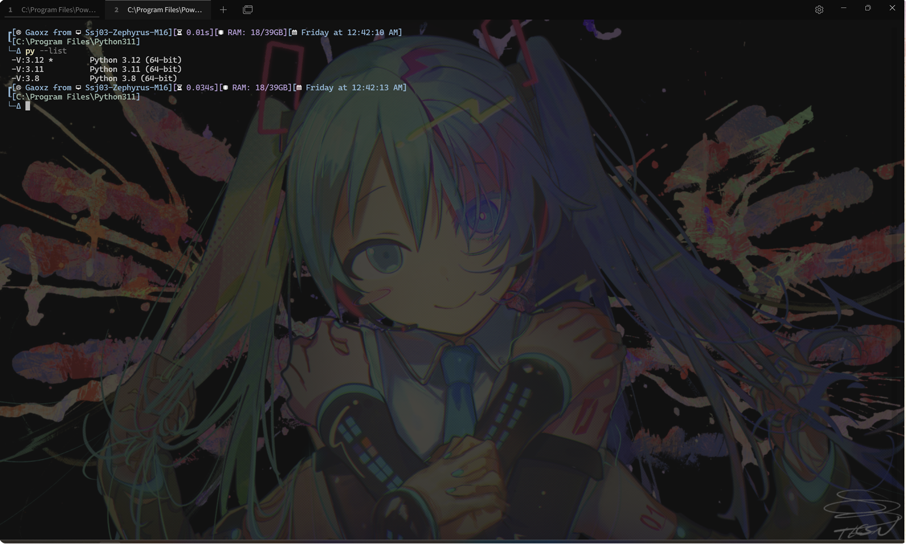

可以看到，示例电脑共安装了3.12、3.11、3.8三个python版本。想要调用具体版本的python，使用下面的命令：

```shell
py -V:VERSION
```

下面给三个具体的示例：

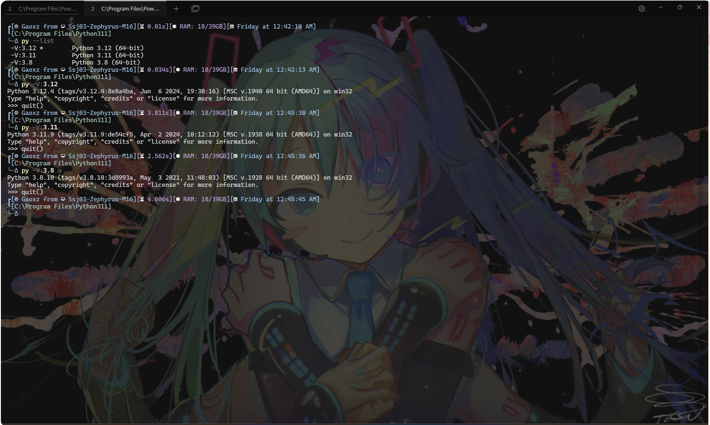

关于py指令的更多使用方法，使用如下命名查看：

```shell
py --help
```

### pip包管理

一般来说，很多python教程都会在安装包的时候建议直接输入下列命令进行包的安装：

```shell
pip install PACKAGENAME

#If above command can't install package, use the command below
python -m pip install PACKAGENAME

#Recommend command
py -V:VERSION -m pip install PACKAGENAME
```

但是如果使用这个方法安装所有包，在不同的项目中很容易因为包过多、每个包之间的依赖关系等问题带来问题。因此强烈不建议使用pip安装所有的包。

但是，还是需要使用pip安装一些基础支持包和环境。

建议安装的包如下：

| Package Name | Description                               |
| ------------ | ----------------------------------------- |
| wheel        | 安装类似Numpy之类的使用.whl格式的Python包 |
| pipenv       | Python虚拟环境管理包                      |

除这两个包之外，其他所有包都不建议直接使用pip安装，而是使用pipenv创建虚拟环境后在各项目的虚拟环境中单独安装。

安装上述的这两个包，请在Powershell中下面的两个命令：

```shell
#Install wheel
pip install wheel
#If above command can't install package, use the command below
python -m pip install wheel
#Recommend command
py -V:VERSION -m pip install wheel

#Install pipenv
pip install pipenv
#If above command can't install package, use the command below
python -m pip install pipenv
#Recommend command
py -V:VERSION -m pip install pipenv
```

安装完成后，在Powershell中输入下一条命令：

```shell
pip list
#If above command can't install package, use the command below
python -m pip list
#Recommend command
py -V:VERSION -m pip list
```

输出的log如下所示：

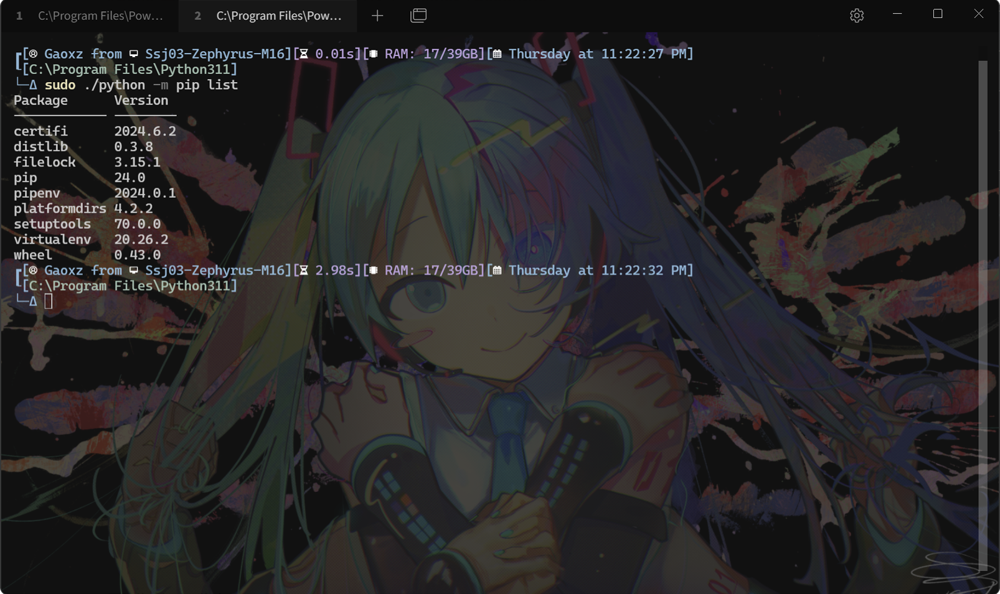

版本不需要与此处所示的版本相同，只需要保证包已安装完成即可。

后续操作请转到共用操作出查看pipenv的具体使用及pip的相关指令。

## Linux安装Python

### Python安装

对于初次使用Linux使用的新手，不建议上来就开始配置多版本的Python环境，本文将只对单版本的Python安装进行解释。

一般的Linux发行版都会预装python，对于Linux可以先直接在bash中输入：

```bash
python3
```

查看是否安装了python，如果没有类似Windows的python环境显示出来，则需要使用下列命令进行安装（需要注意的时，接下来的操作都将使用到管理员权限，没有管理员密码将无法操作）：

```bash
#Debian \ Ubuntu
sudo apt-get install python3

#Arch Linux
sudo pacman -S python3

#Red Hat / Cent OS
sudo yum -y install python3
```

Linux 发行版一般不会预装pip，需要手动安装，安装pip的指令如下：

```bash
#Debian \ Ubuntu
sudo apt-get install python3-pip

#Arch Linux
sudo pacman -S python3-pip

#Red Hat / Cent OS
sudo yum -y install python3-pip
```

### Linux环境下的Python包管理

与Windows使用pip直接安装包不同，Linux中Python包采用的不同的发行策略，一般都需要使用系统的包管理软件进行安装。因此，安装pipenv和wheel需要使用对应的包管理软件指令进行安装。

```bash
#Debian \ Ubuntu
sudo apt-get install pipenv python3-wheel

#Arch Linux
sudo pacman -S pipenv python3-wheel

#Red Hat / Cent OS
sudo yum -y install pipenv python3-wheel
```

安装完后，就可以使用pipenv进行环境配置了。

## pipenv & pip

### pipenv

pipenv是一个非常好用的python虚拟环境配置工具。这个工具可以实现为不同的工程设置不同的python版本、不同的python包依赖环境。同时对于Linux来说，还可以使用pip在虚拟环境中安装所需的python包，使得在Linux中需要使用的命令与Windows环境基本一致。

pipenv的官网如下：

- [pipenv](https://pipenv.pypa.io/en/latest/)
- [pipenv 中文文档](https://pipenv.pypa.io/zh-cn/latest/)

关于pipenv的所有文档都在该网站。

或者也可以在Powershell或者bash中输入下面的命令以得到一些基础参数的提示：

```bash
pipenv --help
```

该命令的输出log如下：

```bash
Usage: pipenv [OPTIONS] COMMAND [ARGS]...

Options:
  --where                         Output project home information.
  --venv                          Output virtualenv information.
  --py                            Output Python interpreter information.
  --envs                          Output Environment Variable options.
  --rm                            Remove the virtualenv.
  --bare                          Minimal output.
  --man                           Display manpage.
  --support                       Output diagnostic information for use in
                                  GitHub issues.
  --site-packages / --no-site-packages
                                  Enable site-packages for the virtualenv.
                                  [env var: PIPENV_SITE_PACKAGES]
  --python TEXT                   Specify which version of Python virtualenv
                                  should use.
  --clear                         Clears caches (pipenv, pip).  [env var:
                                  PIPENV_CLEAR]
  -q, --quiet                     Quiet mode.
  -v, --verbose                   Verbose mode.
  --pypi-mirror TEXT              Specify a PyPI mirror.
  --version                       Show the version and exit.
  -h, --help                      Show this message and exit.


Usage Examples:
   Create a new project using Python 3.7, specifically:
   $ pipenv --python 3.7

   Remove project virtualenv (inferred from current directory):
   $ pipenv --rm

   Install all dependencies for a project (including dev):
   $ pipenv install --dev

   Create a lockfile containing pre-releases:
   $ pipenv lock --pre

   Show a graph of your installed dependencies:
   $ pipenv graph

   Check your installed dependencies for security vulnerabilities:
   $ pipenv check

   Install a local setup.py into your virtual environment/Pipfile:
   $ pipenv install -e .

   Use a lower-level pip command:
   $ pipenv run pip freeze

Commands:
  check         Checks for PyUp Safety security vulnerabilities and against
                PEP 508 markers provided in Pipfile.
  clean         Uninstalls all packages not specified in Pipfile.lock.
  graph         Displays currently-installed dependency graph information.
  install       Installs provided packages and adds them to Pipfile, or (if no
                packages are given), installs all packages from Pipfile.
  lock          Generates Pipfile.lock.
  open          View a given module in your editor.
  requirements  Generate a requirements.txt from Pipfile.lock.
  run           Spawns a command installed into the virtualenv.
  scripts       Lists scripts in current environment config.
  shell         Spawns a shell within the virtualenv.
  sync          Installs all packages specified in Pipfile.lock.
  uninstall     Uninstalls a provided package and removes it from Pipfile.
  update        Runs lock, then sync.
  upgrade       Resolves provided packages and adds them to Pipfile, or (if no
                packages are given), merges results to Pipfile.lock
  verify        Verify the hash in Pipfile.lock is up-to-date.
```

一般来说，比较常用的命令有：

```bash
#Use Default python version to create a virtual enviroment
pipenv install

#Use python VERSION to create a virtual enviroment
pipenv --python VERSION

#Open a shell in virtual enviroment
pipenv shell

#Already used "pipenv shell" command, want to quit this virtual enviroment
exit

#Remove virtual enviroment in current path
pipenv -rm

#Show all package in this virtual enviroment
pipenv graph
```

其中需要特别提出的是，当使用了"pipenv shell"命令后，只要还没有使用"exit"，则在该环境中可以使用pip安装python包（不论是Windows还是Linux）。

此处列出的仅仅只是pipenv极基础的用法，更多用法建议参考pipenv手册（Linux中使用 "man pipenv"或查看本节中列出的两个链接）。

### pip

上文实际上已经提及了pip的安装命令，本节将主要就pip安装包、卸载包、更新包、导出当前依赖包列表、pip自更新进行解释。

```bash
#Install a package
#Only recommend in a virtual enviroment
pip install PACKAGENAME

#Uninstall a package
#Only recommend in a virtual enviroment
pip uninstall PACKAGENAME

#List all package in current enviroment
pip list
#For a specific version python 
py -V:VERSION -m pip list

#Only recommend in a virtual enviroment
python -m pip install –-upgrade PACKAGENAME

#Update pip
py -V:VERSION -m pip --uppgrade pip

#Freeze current pip package enviroment in requirements.txt at CURRENT PATH
#Only recommend in a virtual enviroment
#Use "pipenv shell" before using this command
pip freeze > requirements.txt

#Unfreeze a pip package enviroment from requirements.txt at CURRENT PATH
#Only recommend in a virtual enviroment
#Use "pipenv shell" before using this command
pip install -r requirements.txt

#For help
pip --help
```

上面已经包含了一些常用的pip命令。这些命令不强求需要记住，只需要有一个大概的了解。在使用PyCharm进行开发的时候这些操作都可以使用图形化界面进行配置。但是还是需要有个印象，因为如果不使用PyCharm等现代IDE做项目开发的时候，或者极小可能的情况下IDE或网络抽风的情况下，只能使用命令行做应急的时候还是需要这些命令的。