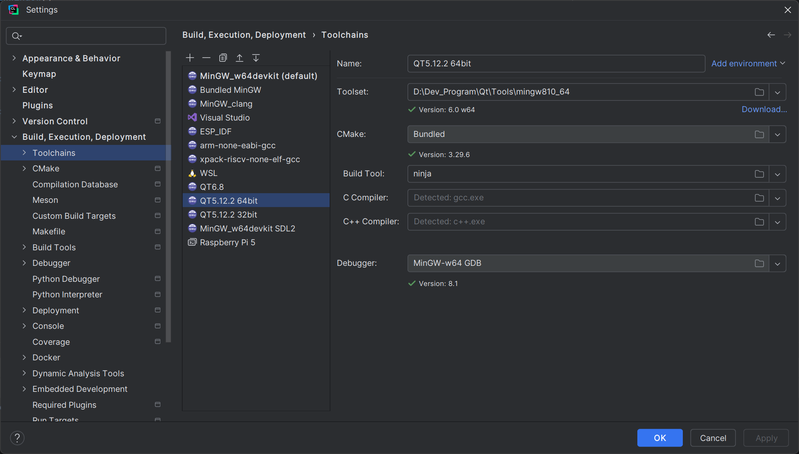
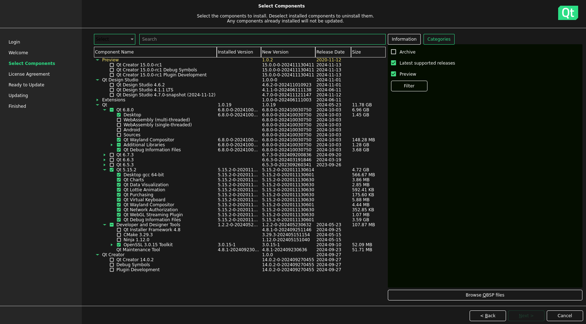

+++
author = "Gaoxz"
title = 'Qt环境配置'
description = "Qt Windows 及 WSL下的环境安装及VScode、Clion配置"
date = 2024-11-17T23:45:48+08:00
tags = [
    "Software",
    "C++",
    "Qt",
]
categories = [
    "Software",
]
+++

# Qt环境配置

本文主要对Windows + WSL的Qt环境配置进行说明。代码编辑工具对VScode和Clion进行了说明，理论上来说使用nvim等其他支持cmake的工具也可以进行配置，但不在此处进行说明（~~因为真的没有用过~~）。另外本文仅针对Qt Widgets进行说明。

## Windows环境配置

### 基础环境配置

1. 在下列网址下载Qt 非商用版本在线安装包，选择对应的系统及CPU架构进行下载。

> [https://www.qt.io/download-qt-installer-oss](https://www.qt.io/download-qt-installer-oss)

2. 下载后运行并输入在Qt官网注册的账号和密码后。阅读协议并根据个人情况进行勾选或输入公司名称。


3. 配置Qt的安装路径并选择自定义安装。


4. 根据个人需求选择Qt的版本及相关的编译工具。如果需要安装Qt5需要选中右侧筛选器的Archive选项。如果在这一步安装了不需要的工具链或者少装了所需的工具链，后续可在Qt Maintenance Tool中进行安装或者删除，基本流程与安装类似。对于Windows平台最好在 Developer and Designer Tools 处将对应的工具链勾选一起安装。cmake和ninja-build如果已经安装可以不勾选。


> [!IMPORTANT]
>
> 在Windows中使用mingw工具链时最好使用Qt安装工具安装对应的mingw工具链而不是选择自行下载类似w64devkit之类的发行版。就算已经自行安装了gcc、g++工具，最好也使用Qt Maintenance Tool安装一个对应的mingw版本。在安装的时候需要注意保持 Qt 中选择的mingw版本与 Developer and Designer Tools 中勾选的mingw版本保持一致。

5. 确认并勾选已阅读协议，点击Next进行安装并等待完成。至此Qt已经安装完成。


### VScode配置

如果不想使用Qt Creator进行代码编辑，可以在使用QC创建完工程后使用VScode打开。

如果需要使用VScode进行Qt开发，需要在VScode中搜索并安装Qt C++ Extension Pack。


之后用 `ctrl + shift + p` 打开VScode的命令面板，并在其中搜索：Qt Register Qt Installation，并将该路径配置到Qt的安装路径下。如果路径配置正确，Qt将自动添加对应的gcc、g++、ninja等工具链。


> [!IMPORTANT]
>
> 在VScode中配置Qt的安装路径时需要注意将路径选择到Qt文件夹中。例如：在Qt安装时选择在`D:\Dev_Tools\Qt`路径下，在VScode中进行配置的时候也需要选择到`D:\Dev_Tools\Qt`，而不能只选择到`D:\Dev_Tools`。

最后最好在QC生成的CMakeLists.txt文件中加入以下语句：

```cmake
# 假设Qt的安装路径为 D:/Dev_Program/Qt ，并且创建的工程使用的是5.15.2版本的mingw8.1 64位工具链
set(CMAKE_PREFIX_PATH "D:/Dev_Program/Qt/5.15.2/mingw81_64")

# 如果不进行该项配置，在不能在Terminal中读取到qDebug()的消息。
set(<PROJECT-NAME> PROPERTIES WIN32_EXECUTABLE FALSE)
```

配置完成后即可在VScode中进行Qt的项目开发。

### Clion配置

如果不想使用QC或者VScode进行开发，也可以使用Clion进行开发。配置Clion中的Qt环境可遵循以下步骤:

1. 在创建工程的时候选择Qt的版本及对应的工具链。


> 图示为使用Qt 5.15.2 mingw8.1的工具链进行开发。这一步相当于在配置CMakeLists.txt中Cmake预设的路径。

2. 在 `Build,Execution,Deplotment -> Toolchains` 中配置好与Qt一起安装的工具链的位置。图示为Qt Maintenance Tool在 `D:\Dev_Program\Qt\` 路径下与Qt一起安装的mingw的位置。



3. 在 `Tools -> External Tools` 中点击新建，添加Qt Designer如下图。Qt Designer用于使用GUI工具对ui文件进行编辑。


4. 这一步可选。在 `Tools -> External Tools` 中点击新建，添加UIC工具。UIC工具用于将ui文件转换为cpp头文件。但是实测在Clion 2024.2中就算不在编译前使用该工具进行转换，也可以正常编译。在Clion中创建新的Qt UI Class后虽然会出现头文件报错，但是在将该类添加到CMakeLists.txt后进行构建，就可以消除该错误。


```shell
Arguments: $FileName$ -o ui_$FileNameWithoutExtension$.h
Working directory: $ProjectFileDir$
```

5. 在使用Clion做Qt项目的时候，一般不需要额外对CMakeLists.txt进行修改，一般来说可以直接运行。只需要在CMakeLists.txt添加自己创建的Qt类即可。

## WSL配置（Linux配置）

### 基础环境配置

1. 事前准备：

```shell
sudo apt-get update && sudo apt-get upgrade -y
sudo apt update && sudo apt upgrade -y
sudo apt install gdb build-essential cmake ninja-build git -y
```


2. 在下列网址下载Qt 非商用版本在线安装包，选择对应的系统及CPU架构进行下载。

> [https://www.qt.io/download-qt-installer-oss](https://www.qt.io/download-qt-installer-oss)

3. 下载后的文件为 `qt-online-installer-linux-xxx-xxx.run` 的格式。在WSL中打开该文件的路径并运行。

```shell
chmod +x qt-online-installer-linux-xxx-xxx.run

sudo ./qt-online-installer-linux-xxx-xxx.run

# 如果不能运行，检查所缺少的依赖项
ldd ./qt-online-installer-linux-xxx-xxx.run
```

4. 与Windows中的基础环境配置的步骤类似，Linux的默认安装路径是/opt/Qt，此处个人没有修改，保持默认设置。


5. 如果使用的是Linux单系统或者只想要在WSL中做Qt开发，可以参考Windows基础环境配置部分进行选择，对于已经安装过的ninja、cmake可以不用勾选。如果已经在Windows中配置安装过Qt，可以参考下图，并根据各人的需求进行选择，在WSL中不需要安装Qt Designer和Qt Creator。



6. 点击Next并等待Qt安装完成。安装完成后Qt的安装路径为 `/opt/Qt/`。该路径后续将用于配置工具链等。

### VScode WSL配置

1. 使用VScode在WSL中开发需要在VScode中连接WSL后搜索并在WSL中安装Qt C++ Extension Pack。
2. 用 `ctrl + shift + p` 打开VScode的命令面板，并在其中搜索：Qt Register Qt Installation，并将该路径配置到Qt的安装路径下（/opt/Qt）。
3. 使用Windows的QC创建一个Qt工程，并用WSL打开该工程的路径，在CMakeLists.txt中添加如下代码

```cmake
# 假设Qt的安装路径为 /opt/Qt ，并且创建的工程使用的是5.15.2版本的gcc工具链
set(CMAKE_PREFIX_PATH "/opt/Qt/5.15.2/gcc_64")
```

如果需要在多个平台使用同一套代码，可以将上面的语句替换为下面的语句：

```cmake
# 假设Qt的Windows安装路径为 D:/Dev_Program/Qt ，并且创建的工程使用的是5.15.2版本的mingw8.1 64位工具链
# 假设Qt的WSL安装路径为 /opt/Qt ，并且创建的工程使用的是5.15.2版本的gcc工具链
if(WIN32)
    set(CMAKE_PREFIX_PATH "D:/Dev_Program/Qt/5.15.2/mingw81_64")
    set(untitled PROPERTIES WIN32_EXECUTABLE FALSE)
endif(WIN32)
if(LINUX)
    set(CMAKE_PREFIX_PATH "/opt/Qt/5.15.2/gcc_64")
endif(LINUX)
```

之后，即可使用VScode在WSL中开发Qt Linux程序。

> 开发的时候如果需要使用ui文件和Qt designer，可以使用VScode插件调用WSL中的Designer进行界面开发，也可以使用Windows中的Qt designer进行配置。

### Clion配置

1. 在 `Build,Execution,Deplotment -> Toolchains` 中配置一个WSL工具链，如图所示。


2. 按照正常的正常的Windows中Clion新建Qt项目的流程先创建一个项目，然后将CMakeLists.txt中的 `CMAKE_PREFIX_PATH` 配置修改为WSL中的Qt安装路径。

```cmake
set(CMAKE_PREFIX_PATH "/opt/Qt/5.15.2/gcc_64/")
```

或者也可以像VSCode中一样配置两个平台的Cmake预设路径。

```cmake
# 假设Qt的Windows安装路径为 D:/Dev_Program/Qt ，并且创建的工程使用的是5.15.2版本的mingw8.1 64位工具链
# 假设Qt的WSL安装路径为 /opt/Qt ，并且创建的工程使用的是5.15.2版本的gcc工具链
if(WIN32)
    set(CMAKE_PREFIX_PATH "D:/Dev_Program/Qt/5.15.2/mingw81_64")
    set(untitled PROPERTIES WIN32_EXECUTABLE FALSE)
endif(WIN32)
if(LINUX)
    set(CMAKE_PREFIX_PATH "/opt/Qt/5.15.2/gcc_64")
endif(LINUX)
```

3. 配置完成后右键单击CMakeLists.txt选择Reload CMake Project。


4. 在 `Build,Execution,Deplotment -> CMake` 中添加配置


5. 如果需要使用ui文件可以跟Windows中一样操作（使用Windows中安装的Qt Designer进行配置）。


6. 与Windows平台一样，只需要在CMakeLists.txt文件中添加自己的文件即可完成构建和调试。