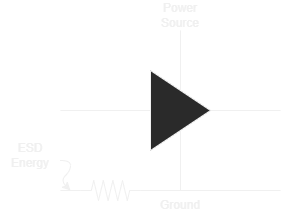
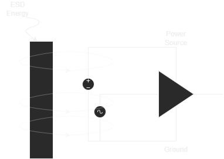
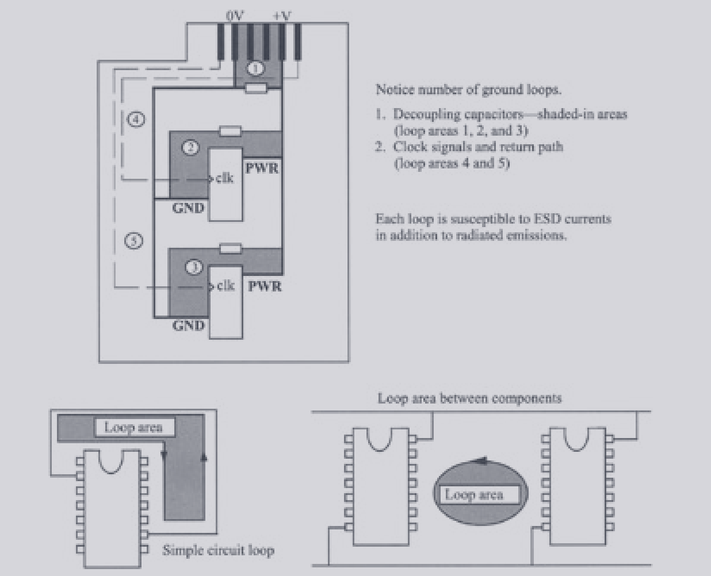
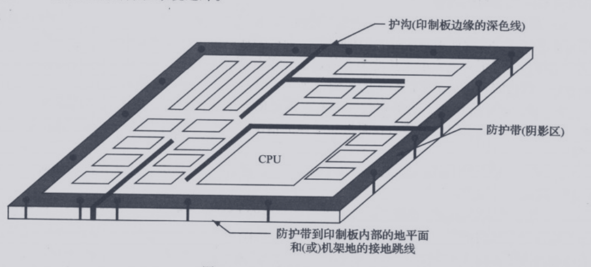

+++
author = "Gaoxz"
title = '静电放电防护'
date = 2024-09-05T15:02:26+08:00
tags = [
    "Hardware",
    "EMC",
    "ESD",
] 
categories = [
    "Hardware",
    "EMC",
]
+++

# 静电放电防护（Electrostatic Discharge Protection）

## 概述

印制电路板（PCB）必须要做静电放电（ESD）防护，防护的位置主要针对 **I/O** 和 **使用者可能接触到的地方**。

ESD能量在开始积累的阶段需要经过一个较慢的过程（通常是数分或数秒），积累的静电能量存储在一个电容结构的物体中（人体、家具、未连接的导线），之后一个极快的速度将积累的电荷释放（通常在ns级的时间内）。这个ns范围的脉冲能量通常会产生一个 x00MHz ~ 1GHz 的EMI干扰。人体的静电放电（HDM模式）的放电上升时间大约是 200ps ~ 10ns，放电过程中的脉冲电流可能会达到 xA ~ 30A 甚至高的电流。由于静电放电的电流具有高速度（放电时间短），静电放电的能量谱密度有宽频谱范围的特点，ESD能量能够损坏电路、产生地弹、甚至通过电磁耦合引发电路故障。

由ESD的上升时间和ESD电流大小，可以引出两个ESD的重要参数：

- 电流峰值时的电压值
- 电流的变化率$\frac{dI}{dt}$

由ESD的上升时间也可以引出对应上升时间对应的频域公式：

$$
f = \frac{1}{\pi * t_{r}}
$$

由该公式可以得出一个典型的 1ns 的静电放电能量对应的频域是 318MHz ，也可以据此计算出HDM模型的对应的频域范围是 30MHz ~ 1.6GHz。通常在对静电放电进行分析时可以将其等效为一个300MHz的信号。

## ESD失效模型

### 失效模型

静电放电引发的故障可以大致地分为两类失效模型：元器件损坏和操作性能损坏。

元器件损坏不一定是焊接在PCB之后才产生，生产、运输中的静电都可能导致元器件损坏。由ESD导致的元器件损坏通常有PN结击穿、完全烧毁或融化。这类的损伤是永久性的，通常表现为短路（会产生大量的热，可以通过红外成像仪进行检测）或电路的电压被钳在一个与正常工作电压不同的电压上。另一类轻微的ESD损伤不会立刻导致元器件的损坏，通常最初功能是完好的，有可能会因为静电、超出工作温度范围、过压工作等 导致电路功能逐渐不正常甚至永久失效，这类的潜伏损伤很难识别和解决。

操作性能损伤可能由直接或间接的静电能量干扰导致。当ESD电流足够大时，电路会重新动作，从而引起操作性能损伤（未按照预期情况动作）。对于逻辑电路，静电的干扰可能会导致状态发生变化，从而引起逻辑错乱导致程序锁定或内存混乱。

| 放电类型 | 说明                                                         |
| -------- | ------------------------------------------------------------ |
| 直接放电 | 放电设备直接对待测设备（EUT）进行的放电。这种放电可能时电源和电路之间的电接触放电（接触放电），也可能是通过空气对PCB上的金属物体放电（空气放电）。 |
| 间接放电 | 放电设备对EUT附近的金属物体放电，干扰由于电磁辐射耦合到电路中的情形。 |

元器件的损坏程度主要取决于设备的 **静电能量损耗能力** 和 **器件的耐电压等级**。这些参数通常称为ESD灵敏度。

### ESD影响PCB的基本模型

#### 1. 直接放电

ESD电流对敏感电路直接放电引起扰动或损坏电路。这种情况在触摸PCB和数字元器件时会发生。在该模型下，来自外部的直接对元器件的放电可以携带能在成器件损坏的ESD能量，但是只需要使用很小的 **串联电阻** 或者 **分流电容** 就可以限制ESD电流。

为了防护ESD对连接器放电导致内部敏感电路损坏，在连接器处使用滤波器消耗ESD能量，或将敏感电路的连接器远离外壳边缘使静电的路径变长都是必要的有效的方法。

#### 2.静电对接地系统直接放电

ESD电流流过地从而引起器件损坏或扰动。这种情况通常出现在底板和电路地直接连接的系统中。一旦ESD进入电路地，在PCB上的任何位置都有可能会引起问题。在该模型下，ESD电流不一定会损坏电路，但是ESD电流会从不可预知的路径经过，从而干扰电路的正常工作状态。

对于这种模型下的ESD电流来说，较小的杂散电容（寄生电容）会成为一条低阻抗路径，而导线的电感太大将成为一条高阻抗路径。放电电流流过的使接地通道而不是信号通道。对于1ns上升时间的ESD来说，地阻抗可能就不是低阻抗，由此就会导致地弹。

地弹或者参考0电位电的飘逸，可以驱动CMOS电路进入锁定状态。在锁定状态下，ESD实际上并为对电路中的元器件产生实质的损坏，在该状态下电源可能会损坏器件，或者在最好的情况下，电路变成一个在复位钳无法实现既定功能的电路。

对于一个金属外壳的产品的电路，地弹问题可以通过确认所有可能接收到ESD能量的位置有一个低阻抗的接地方式连接到地（保证大地的可靠连接，保证地平面的完整性），为ESD能量提供一个低阻抗的泄放路径。

对于一些塑料外壳的产品的电路，一方面需要隔离和隐藏电路上的金属部件避免直接放电，另一方面，金属部件如果需要与电路地连接，需要在金属部件与地之间接入一个 **10k** ~ **100k** 的电阻以保证峰值电流连入时是一个高阻抗路径。这些电阻不会影响参考0电位。***但是，如果金属部件之间放置过于紧密，由于金属之间的电容耦合起主要作用，此时电阻就不起作用了。***

#### 3. 电磁场耦合引起的扰动（间接放电）

该模型通常不会造成器件损坏，但是具有非常高阻抗的器件也可能在这种模型下损坏。在该模型下，仅有极小的能量会直接耦合到被干扰电路中，这种感应到的耦合电压通常不会对逻辑功能造成干扰。这种故障模式很大程度上取决于放电的上升时间（dI/dt）和电路的环路面积，而与屏蔽无关。

这种间接放电是由强磁场对临近的电流环路耦合产生的。耦合的强度随环路面积的增加而增加。PCB的环路区域除了会引入外部磁场，也因此会允许辐射磁场进入内部电路。该模型通常发生在塑料外壳的产品上，其中外部放电通过直接耦合的方式耦合到内部电路中

这种模型下减小ESD干扰的主要方法是减小PCB的环路面积（使用多层板或者优化两层板）。电缆和PCB的布线要尽可能地靠近金属回流的路径以尽量减小环路面积。

#### 4. 放电前由静电场引起的干扰

这种干扰不像其他三种方式一样普遍，一般只会发生在高阻抗、高敏感的电路中。

这种放电方式是在绝缘体上经过较长时间的电荷重组产生电压，如果这个电压足够大就会经过空气或绝缘物质快速击穿，产生ESD电弧。一般来说，这种放电方式在HDM模式的实验中一般是由于实验人员的不操作导致（静电实验需要对外壳是绝缘材料的产品定次数地使用接地的金属网接触放电）。

> 由于ESD是一种瞬变现象，高速数字电路相比低速模拟电路和低带宽的数字电路更容易受到静电干扰。虽然在事实上ESD很少会对模拟电路的功能产生影响，但是仍然需要在设计模拟电路和数字电路时考虑ESD问题。特别是对与边沿时间小于3ns的数字电路。

## 静电防护技术

PCB的静电防护的基本理念是减少场的耦合，以下是几个常用的PCB适应EMC的技术，这些方案可以在一定程度上消除ESD的耦合和干扰：

1. 使用滤波器在源端削弱ESD能量；
2. 利用滤波器在负载端削弱接收到的ESD能量；
3. 将元器件相互分离以减小耦合；
4. 降低电源和负载见耦合的效率；
5. 通过调整ESD敏感器件的排布为垂直于ESD干扰去的方法减小耦合效率；
6. 在元器件上方加入一个良好接地的金属屏蔽罩；
7. 减少发和接收天线的阻抗以减小电场耦合；
8. 增加天线阻抗以减小磁场耦合；
9. 使信号线与地之间结构耦合

以上方法的第7条和第8条具有相反的实现方式因此在实践中较难同时实现，因此这两条具体根据那种方法做实现需要根据实际情况选择。

设计的总体原则的优先次序如下：

1. 防止电荷直接进入PCB电路导致电路损坏；
2. 防止静电电流产生的场带来的问题；
3. 防止静电场的问题。

由于人能够与电路或系统接触的任何地方都可能会引起损坏，所以一个较为明确的思路是要保护所有线路，包括信号、电源和地路径。采用串联高阻抗的方式防止ESD电流进入PCB（串联电阻、串联铁氧体磁珠，串联电容滤波器等）。或者提供一个对地的低阻抗通路，使其接地阻抗变得非常低，从而使地弹不会成为主要问题。

在电缆的屏蔽效果不好或者电缆没有屏蔽的情况下，就需要注意在模块级或者元器件级一直瞬态能量。对于一个低速模拟系统，其信号变化缓慢，进行ESD测试的时候需要接入一个低通滤波器以阻止ESD发生时的高频能量进入。

当发生静电放电的电磁场耦合时，瞬态噪声是以共模形式耦合到系统的，这就意味着，耦合能量是在同一时间以相同的极性作用到所有电缆和连接器上的。这时可以在电缆上加装铁氧体磁芯、或在连接器附近假装共模电感等共模滤波器以抑制共模噪声。

### 单层和双层PCB的ESD防护技术

单层PCB和双层PCB很容易被直接放电或间接放电导致干扰或损坏。这类PCB能用的防ESD技术较少，做这类PCB的防护首先需要考虑阻止ESD传播到PCB。较高的接地阻抗和ESD干扰容易导致较高的地弹电压。

对于单层和双层PCB，其接地阻抗较高时导致地弹的主要因素。因此在这类型的PCB中使用对地的滤波电容作用不大。如果没有一个能够转移ESD电流的良好接地平面或者0电位参考平面，那么每一条信号线都需要有高阻抗的串联元器件（减弱ESD能量，使ESD能量尽量多地消耗在串联地高阻抗元器件上）。

一方面，这类PCB也可以使用一个外部的辅助接地平面，这个地平面需要尽可能近地靠近PCB，并且以尽可能低钻孔那个地方式与PCB上的地连接。这样相当于给PCB增加了一个完整的地平面，可以从一定程度上降低地线的阻抗

另一方面，也需要控制这类PCB的环路面积，这需要有较好的元器件布局和布线。减小PCB的环路面积也与EMI问题有关。关于这一点可以遵循以下原则：

1. 电源线和地线采用紧邻布线的方式，使两者的间距达到最小
2. 如果需要使用多个电源和接地线，要用网格的方式连接在一起。网格式布线会提供一个更小的环路区域。更小的环路面积可以提供较低的感应电流和磁场耦合。
3. 信号线平行布线并相互靠近，以降低RF回路电流环路面积
4. 信号线在布线的时候要尽可能地靠近地线。
5. 在电源和地之间接入高频旁路电容，一边在ESD频率段（通常可以取300MHz）维持低阻抗值。**需要注意的是，由于一般高频电容都是pf级别，一般不能应对大量的顺便电流，引线电感也可能因为这些旁路电容导致在ESD频段内失效。**

### 多层PCB的ESD防护技术

多层PCB的ESD防护可以分为三部分：元器件级、布局布线级、系统级。

#### 元器件级防护

元器件级别的静电防护是防止ESD耦合到对干扰敏感的电路中去。瞬态抑制器件包括 **分离元件** 和 **滤波器**。

##### 1. 使用高压瓷片电容

使用高压瓷片电容将放电的能量分流到EARTH上。电容需要放置在连接器的附近并且采用感抗尽可能低的引线连接方式。

##### 2. 使用雪崩二极管（TVS）

防护TVS通常需要接到EARTH以获得最好的防护效果。对于浮地外接电源的系统也可以将TVS接到外部电源的公共地上。

##### 3. 使用LC滤波器

使用衰减高频的ESD能量，用电容将高频的ESD能量分流到EARTH（或者外部公共地）。该方法可以同样可以防止EMI发射到外部线路中。在使用的时候需要将滤波器尽可能的靠近ESD源的位置。

##### 4. 增大电源和地之间的高自谐振频率的旁路电容

旁路电容需要具有尽可能低的ESL和ESR（在ESD频率范围内能够提供较低的接地阻抗）。对于低频高脉冲的情况，在电源和地平面间使用多个旁路电容能够减少环路面积。对于高频ESD，电容器的容性减弱，同时会表现出一定的感性。

##### 5. 铁氧体、磁珠、共模电感（EMI滤波器）

磁性材料可以较好地衰减ESD电流，还能增强对EMI的抑制。使用铁氧体磁铁在连接器处将电缆缠绕，以及在输入输出的线路上传入磁珠或EMI滤波器。

##### 6. 使用有钳位二极管防护的CMOS或TTL。

可以将这些器件用于ESD敏感电路。

##### 7. 使用串联电阻限制ESD电流防护CMOS电路。

这种方法主要是通过串联的电阻对ESD能量进行损耗。

#### 布局布线级防护

##### 1. 使用多层PCB并保证有完整的地平面

需要让接地平面尽可能的靠近布线层，同时保证一个或多个完整的地平面，同时用尽可能多的地孔保证接地的低阻抗。

##### 2. 若不确定哪根导线是容易收到ESD干扰的，则最好在每个元器件的每个引脚都进行滤波

1. ESD包含快速的大电流脉冲但是能量小，因此不必使用尺寸很大的滤波元件。但是旁路电容不应该选择过小的容值，否则有可能会导致电容器快速充电到不可承受的电压值导致电容器损坏；
2. 如果不能使用高频滤波器，必须使用TVS进行防护（MOV等响应速度较慢的器件无法对电路起到防护作用）；
3. 不宜使用压敏电阻和电弧抑制元器件等响应速度过慢的器件做ESD防护；
4. 模拟电路通常不需要进行ESD滤波，数字电路对ESD敏感必须进行滤波；
5. 滤波器接电路地有较高的风险。只要可能，最好就将滤波器接到屏蔽罩上（EARTH）；
6. 所有元件，特别是MCU和其他数字芯片都需要加旁路电容，特别要确保将旁路电容用于高阻抗反馈电路。

##### 3. 保证多层PCB和连接器间尽量用阻抗较低的方式进行连接

当一个PCB与另一个PCB通过连接器连接的时候，需要保证两者之间有足够的接地插针。

##### 4. 减少环路面积

确定可能存在的环路电流的区域。这类区域包括 两个元器件之间的远距离空档区域、IO连接器 和 元器件/电源平面。环路面积既包括信号线（RF回路），也包括电源供电回路。

##### 5.电源和地之间需要紧密耦合

在多层PCB中让电源平面和地平面尽可能靠近，或通过在电源和地之间接入具有高自谐振频率的退耦电容实现电源和地之间的紧密耦合。优先通过层叠方式使电源平面和地平面紧密耦合。

##### 6. 顶层和底层尽可能多地铺地

这种方法的优点是提供了一个低阻抗路径。采用这种方法的缺点是ESD脉冲可能对接地系统直接放电，由此可能会产生地弹。

采用这种方法必须要注意地附近是否有可能的引入干扰的区域，如果有这类区域需要尽可能远离干扰区域。

如果PCB的外侧四周采用了地覆盖，要将地覆盖平面以多点间隔的方式连接到地平面或大地上。

##### 7. 在使用多层PCB时需要多打地孔

多打地孔有助于减小地平面和内部线路之间的环路面积

##### 8. 在ESD敏感器件和其他功能区域之间加入开槽和隔离。

需要注意，开槽增强ESD防护的原理是通过将完整的地平面隔开，从而增大在开槽区两侧在ESD频率范围内的地阻抗从而形成一个高阻抗的通路，一定程度上限制ESD电流从开槽区一侧传向另一侧，这种防护方式会影响到在ESD频率范围内甚至更高频的信号的信号完整性。

##### 9. 将瞬态保护器件连接到EARTH而不是系统地

若连接到系统地中将会导致ESD的大电流进入系统提引起地弹导致器件损坏。在浮地外接电源的系统中，也可以将TVS接到外接电源的公共地上。

##### 10. 尽量减小布线长度

根据线的长度不同，线在辐射发射（EMI）和敏感性方面都会对系统都会有不可忽略的影响。走线长度在特定的波长和谐波频率下是敏感的。如果是采用微带线的方式走线，走线将更容易接收到ESD能量。在对ESD干扰敏感的区域，将功能相似的组件尽可能相互靠近地分组是非常重要的。

##### 11. 使信号线尽可能地靠近地线、地平面

信号线与地平面尽可能地接近可以通过信号线与地平面之间地寄生电容一定程度上将ESD能量通过一个相对更低阻抗的回路泄放。

#### 系统级防护

1. 对ESD干扰敏感的元器件和电路进行屏蔽。将屏蔽体多点牢固地连接到EARTH上，为屏蔽体吸收的ESD电流提供一个低阻抗的泄放通道。如果不容易实现屏蔽就要就行有效的绝缘；
2. 内部线缆的布线需要避开缝隙和开口的位置；
3. 保证EARTH的接地可靠性，尽量减少EARTH各接地点之间的阻抗差异；
4. 在使用触摸按键的时候，需要将膜片的导电层凹进去，以免对数字电路直接放电；
5. 将导电膜片层端接到外壳的屏蔽体上，在使用导电率相对较低的导电材料的时候也需要这么处理；
6. 采用金属外壳的连接器，需要将连接器的外壳可靠地连接到EARTH上；
7. 避免尾纤。除了是RF能量的辐射器之外，尾纤可以也看作是ESD的环形天线，会对ESD和EMI都产生影响。如果尾纤不能避免，必须要使其远离信号线和I/O线缆。不要将外壳的地使用线缆端接至PCB的接地结构（使用机箱接地）。

## 金属包边的ESD注意事项

金属包边的使用旨在最小化PCB在塑料外壳内使用时的ESD风险和PCB被拿起时的ESD风险。当PCB被拿起时，PCB可能会获得静电电荷，静电电荷会通过辐射或传导两种方式传导到PCB的走线或元器件上。当对边带直接放电时，就会发生系统级的故障。

为了防止ESD经辐射或传导耦合直接对元器件产生影响，可以在整个PCB四周（包括PCB顶层和底层）放置一个3.2mm的金属包边。金属包边到元器件或走线最少要有5mm的距离。这样的间距可以确保在保护边带和电路间被电压击穿时，两者不会发生ESD电弧放电。

顶层包边和底层包边每13mm的距离需要用过孔连接。过孔确保两个包边能够相互牢固地连接在一起，并为ESD能量在两个边带之间提供一个最低阻抗的路径传输。

由此引出一个问题，是否需要将金属包边与地平面连接？

###  1. 金属包边与地平面连接的情况

如果PCB时安装在一个金属机壳内，并且采用多点接地的方式连接到机壳内，保护边带需要接到地平面上（大地PE）。应用中保护边带和地平面连接的目的时让ESD能量能够顺一个非常低阻抗的路径到达金属大地PE。

### 2. 金属包边不与地平面连接的情况

如果PCB是被封装在一个塑料外壳内部，或者只在电源输入端单点连接到大地上，由于以下原因就不能将保护边带与大地连接：

- 如果金属包边和地平面连接，地平面将产生高能量的地弹，能量将无处释放从而导致元器件永久性虽坏；
- 如果PCB单点接到电源输入连接器的地上，全部的ESD电流都将以尽可能低阻抗的方式流向连接器的接地点，该能量相当大，能够对路径上几乎所有元器件造成影响；

另外，金属包边不能连城一个封闭的环。如果金属包边是一个封闭的环路，对外部电磁环境来说就是一个磁场环路天线，一方面会对外辐射（EMI），另外一方面也更容易接收外部的干扰。

如果PCB的开槽一直延伸到板边，金属包边就一定要在开槽处断开，截断的金属包边就不会继续对EMI和ESD性能产生影响了。另外，保护边带的过孔直径和截断处的宽度需要大于0.5mm。

## 静电问题的排查思路

在排查静电问题之前，首先需要形成一个认知，即 **ESD问题是一个系统级问题，该问题与硬件工程师（所有情况下）、结构工程师（大部分情况下）、软件工程师（极个别情况下）都有关系**。在实际的工作中个人遇到一部分结构工程师抱着静电只是硬件工程师需要考虑的想法，整改的时候不参与问题分析也不想参与，这样的想法其实是错误的。

在进行最开始的硬件和结构设计的时候，就需要考虑到产品是否能够良好接地、产品的接口缝隙、产品缝隙附近是否有不可避免的金属器件、产品接口位置、接口类型等，这些问题都需要在产品设计的时候进行考虑，并需要硬件工程师与结构工程师进行良好的沟通。硬件工程师在进行原理图设计和PCB Layout的时候需要在靠近接口处加上合适的TVS、ESD器件（选择具有合适的最大钳压、有合适的峰值脉冲功率、结电容能够满足需求的型号）；在电源及容易受扰的线路上在靠近接口处加入相对较大的电容（对于开关电源需要注意其最大容性负载）；将内部铺铜、内部线路等尽量远离产品的缝隙或者其他可能引入干扰的位置。

如果静电问题还是不可避免的发生了，可以遵循以下步骤进行排查：

1. 确认静电干扰导致产品失效的位置

这一步最为关键并经常会被一些人忽略，并归结为“偶发性失效”、“器件的静电抗扰性能差异”等从而未引起重视。一些静电问题通常触发的位置比较苛刻，且位置可能会相对比较难找。但即便如此还是应该在失效的位置多实验几次并使用多台样机相互对照。

2. 根据失效位置推ESD干扰模型

这一步需要根据 是否产生放电现象、ESD干扰施加位置附近器件及线路、失效状态的表现（操作性能损坏 or 器件损坏） 等进行综合分析。

3. 根据干扰模型、干扰位置的不同选择静电防护技术

一般来说可以在接口处换用峰值脉冲功率更大的TVS或ESD器件解决，但同时也需要关注器件的最大钳压是否合适。在线路上串联 1k~10k 的电阻也能够较为有效的降低ESD带来的大电流对器件的影响。在一些离缝隙较近的器件、线路在一定程度上也可以这么处理。但通常这么处理只是对接口更为有效。

将静电干扰附近的铺铜或线路向板内缩（增大铺铜和线路到干扰位置的距离），结构上减小缝隙、增厚结构件、热熔胶将电路板上器件包裹住不暴露在空气中等，这些方法的思路是增长或阻断放电路径，这种方法通常能够对有放电现象、系统不直接接大地的系统有一定的效果。

对于有直接接大地的产品，若干扰位置在本应接地的位置，则需要检查接地是否良好。需要检查器件本身的大地是否连接良好、硬件焊接是否良好、硬件大地与结构金属连接处是否良好、结构件是否能够良好接地。在确认好接地良好后，需要根据具体的失效表现，推测可能受到干扰的器件及干扰引入的原因，再进行整改。

另外，对于两层板，一种最简单且有效的解决方法就是将两层板改为四层板，以增大 电源-地、线路-地 的耦合度，使静电干扰能够以最快速度泄放或使 电源-地、线路-地 之间的电压能够被钳压到安全的范围。

4. 重复实验直到问题解决